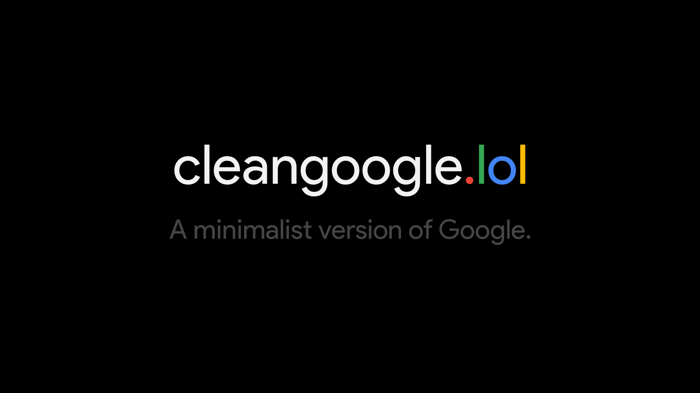

# cleangoogle.lol
A minimalist version of Google.

### Features
- Minimalistic design
- Widgets
- Light and Dark Mode

### Avaliable widgets
|Name|Description|
|---|---|
|Time widget | Displays time, formatting avaliable soon!|
|Quote widget | On every load, you get a random quote!|
|Weather widget | Display current temparature of your location!|

### How to set up weather widget
- Get an API key for [OpenWeatherMap](https://openweathermap.org/api)
- In the settings menu after enabling the weather widget, you just paste the API key there and save!

**Information**
The API key is not stored server-side! Every information is store locally in your browser!

For any questions, feel free to contact me!
Happy googling!